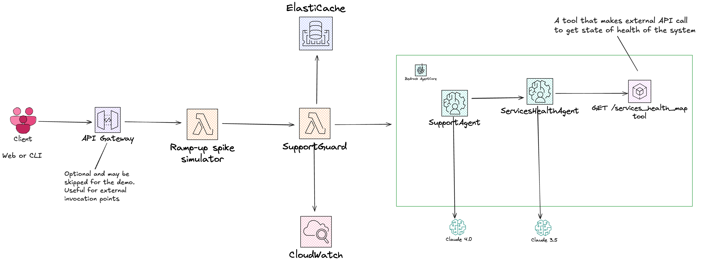

# Semantic Support Desk for Retail Incident Spikes

## Scenario

During a peak sales event (e.g., Black Friday), an online retailer experiences intrmittent checkout failures, API latency, cart synchronization issues, etc.
Thousands of customers and merchants simultaneously contact the retailer's support desk. Their described symptoms differ:

- "Checkout keeps failing - is there a payment outage?",
- "Iteam disapear from cart when trying to pay",
- "Are your servers down? Nothing loads after shipping page",
- "Why do orders say procesing for 20 minutes",
- "We are loosing sales - is there a known issue?"

Yet they refer to the same underlying issue. This creates a [thundering herd incident](https://en.wikipedia.org/wiki/Thundering_herd_problem)
for the retailer's support platform...

All customers want to know **(1)** what's happening, **(2)** if it is a known issue with checkout service, and **(3)** what mitigation steps exist.

This presentation aims to demonstrate how the support can leverage
**Bedrock AgentCore + Strands** with **semantic caching** to dramatically reduce response latency and cost during such incidents.

### What does this scenario bring?

- **Outages** = huge simultaneous spikes of similar queries
- **Stable answers**: _”Known issue with checkout service due to peak load. Engineering team is deploying a mitigation. Retry in 2–3 minutes."_ is valid for minutes or even hours
- Opportunity to showcase a **multi-agent scenario in AWS landscape**
- Opportunity to highlight usage of **agentic tooling** within the flow (**call external endpoint**)
- **Semantic caching** relevance. Same intent phrased differently
- **ROI clarity** - show cache hit ratios rising over time, and latency dropping from seconds to milliseconds
- **Relatable** - re:Invent attendees have likely lived through high-traffic incidents
- **Fast turnaround** - minimal code required
- **Non-sensitive**. No user PII, PFI or PHI used in the demo

## Architecture

### Diagram

### Flow

1. **Client** initiates request burns (parametrizable), e.g. `POST /simulate?cache=true`
2. **API Gateway** routes to **Simulate Demo Spike (Lambda)**. Gradually increases request throughput, e.g.: start with 1 user/second and ramp to 100 users/second over 30 seconds
3. For each request **Bedrock AgentCore** is invoked. Payload includes `cache_enabled` flag
4. **Bedrock AgentCore** dispatches to **CacheLookupAgent** (Claude 3.0). Uses **Titan** embeddings to generate semantic vector for the query
5. **CacheLookupAgent** queries **ElastiCache (Valkey)** for near-duplicate embeddings:

- ✅ if **cache hit**, return cached response to **AgentCore**
- ❌ if **cache miss**, forward to **SupportAgent**

6. On cache miss, **SupportAgent** (Claude 4.0) analyzes the issue, and based on the wording of the questions/comments it asks **ServicesHealthAgent**.
7. **ServicesHealthAgent** queries its model with the request from the user and includes `GET /services_health_map` tool in the message.
8. `Claude 3.5` understands from the request that it needs to invoke the tool to have context, and asks **ServicesHealthAgent** to invoke the tool and return the result.
9. **ServicesHealthAgent** uses the tool to get current systems' health and forwards it to `Claude 3.5`
10. **ServicesHealthAgent** takes the generated response and forwards it back to **SupportAgent**.
11. **SupportAgent** passes response to **CacheWriteAgent**. The latter writes results and embeddings back to **ElastiCache**
12. **BedrockAgentCore** aggregates results and returns to the client simulator

- For components decouplement, instead of the simulator we can (should?) forward request/response to a different component for emitting metrics to CloudWatch

13. **Lambda** logs and emits to **CloudWatch**:

- latency per call
- Bedrock token cost estimate
- cache hit/miss ratio

14. **CloudWatch Dashboard** visualizes:

- Average latency drop
- Bedrock cost savings
- Cache efficiency
- Request volume over time

15. **(Optional)** Operator triggers **CacheReset Lambda** to clear cache (`FLUSHALL`) for the next run

If time **and budget** allow, it would make our case stronger if we could replay the demo with `cache=false` - to leverage path that would skip completely caching.

### Critical Analysis

This acrchitecture spotlights the ease of creating and deploying agents with AWS AgentCore. It illustrates a multi-agent and multi-model
application creation. Unfortunately, due to these same reasons, this architecture defeats the main purpose of using a semantic cache for
reducing costs and resource consumption during a surge of customer requests:

- Two agents that are required to read and write to cache exhaust tokens. `CacheLookupAgent` is guaranteed to do so on every single request
  - They are using a cheaper model which costs a fraction of percent of what `SupportAgent` costs, nevertheless this is a waste of money
- Even more critical, both read/write agents introduce additional latency - exactly one of the KPIs that we are trying to optimize
  - To make things worse, `Claude 3.5` (model behing read/write agents) will need to call tools inside agents before making a decision whether to proceed or skip forwarding to `SupportAgent`. That doubles both latency (extra exchange) and token consumption - our two KPIs

## Alternative Architecture

The revised architecture flow addresses these issues at the expense of reducing the case for AgentCore/Strands.
It takes a more cost-saving and pragramtic approach. Arguably even the remainder of `AgentCore` components left
could also be dropped to further save on cost purely for the purpose of this demo, but we keep it more
to mimic a real life scenario of having a more sophisticated support agent for addressing a plethora of customer related questions.

### Revised Flow

1. **Client** initiates request burns (parametrizable), e.g. `POST /simulate?cache=true`
2. **API Gateway** routes to **Ramp-up spike simulator (Lambda)**. Each request must include a unique identifier (UUID v4) and a `start` timestamp. Gradually increases request throughput, e.g.: start with 1 user/second and ramp to 100 users/second over 30 seconds
3. Each request is forwarded to the **SupportGuard** (Lambda). This component generates the embeddings for request body and queries **ElastiCache (Valkey)** for near-duplicate embeddings:

- ✅ if **cache hit**, logs and emits to **CloudWatch**:
  - latency per call
  - Bedrock token cost estimate
  - cache hit/miss count
- ❌ if **cache miss**, forwards to **Bedrock AgentCore**

4. **Bedrock AgentCore** dispatches the request to **SupportAgent** (Claude 4.0) which analyzes the issue.
5. **SupportAgent** generates structured response or recommended fix.
6. **Bedrock AgentCore** returns intial request and response to **SupportGuard**.
7. **SupportAgent** (Claude 4.0) analyzes the issue, and based on the wording of the questions/comments it asks **ServicesHealthAgent**.
8. **ServicesHealthAgent** queries its model with the request from the user and includes `GET /services_health_map` tool in the message.
9. `Claude 3.5` understands from the request that it needs to invoke the tool to have context, and asks **ServicesHealthAgent** to invoke the tool and return the result.
10. **ServicesHealthAgent** uses the tool to get current systems' health and forwards it to `Claude 3.5`
11. **ServicesHealthAgent** takes the generated response and forwards it back to **SupportAgent**.
12. **SupportAgent** forwards the response along back to **SupportGuard**.

- For components decouplement, instead of **SupportGuard** we can (should?) forward request/response to a different component for emitting metrics to CloudWatch

12. **SupportGuard** logs and emits to **CloudWatch** same metrics as in point 3
13. **CloudWatch Dashboard** visualizes:

- Average latency drop
- Bedrock cost savings
- Cache efficiency
- Request volume over time

14. **(Optional)** Operator triggers **CacheReset Lambda** to clear cache (`FLUSHALL`) for the next run

If time **and budget** allow, it would make our case stronger if we could replay the demo with `cache=false` - to leverage path that would skip completely caching.

### Critical Analysis

The alternative architecture wins in terms of overall performance, but it comes with trade-offs:

- Increased complexity, with an additional element being added to the flow
- **SupportGuard** adds guaranteed latency bump-up, even though it is insignificant compared to forced two-way Claude 3.5 querying
- Critical metrics calculation becomes harder and more nuanced
- Demo misses to highlight a multi-agent scenario within `AgentCore` runtime
